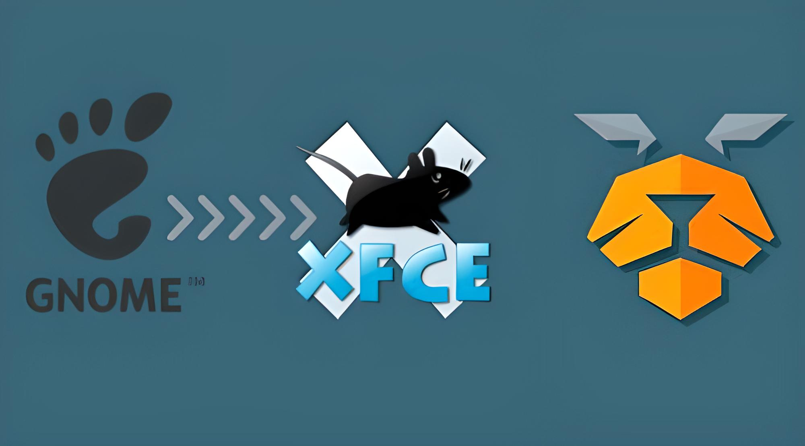

# Pardus GNOME to XFCE
KODLAR GELİŞTİRME AŞAMASINDADIR.

Scripte GNOME masaüstü ortamından XFCE masaüstü ortamına geçiş için aksiyonlar eklenmektedir. Script henüz TEST EDİLMEMİŞTİR. Lütfen Vmware, Vbox, Kutular uygulaması üzerinden test ediniz. Ana sisteminizde denemeniz çökmelere sebebiyet verebilir.

Pardus kullanıcılarının farklı masaüstü ortamlarını denemesiyle oluşan artık
dosyaları temizlemesine yarayan kod betiği. Script geliştirme aşamasındadır.
Farklı aksiyonlar eklenmesi planlanmaktadır.

## Kurulum
Öncelikle XFCE arayüzünü yüklerken GNOME arayüzünü silme işlemi gerçekleşeceği için tty1 ekranına geçmeniz gerekmektedir. CTRL+ALT+F7 kombinasyonu ile tty1 ekranına geçerek oluşabilecek arayüz çökmesini önleyebilirsiniz.

Kurulum için aşağıdaki komutlarla bu git reposunu kendi cihazınıza klonlamanız
gerekmektedir.

```
git clone https://github.com/mhmmdeminkl/Pardus-GNOME-to-XFCE.git
cd Pardus-GNOME-to-XFCE
```

Kurulum işlemi bitmiştir.

## Çalıştırma
Şimdi basitçe aşağıdaki komutla çalıştırabilirsiniz.

```
bash temizlik.sh
```

Script çalıştığında gerekli uyarıları yapmaktadır. Sorumluluğu alıp onay
vermeniz durumunda Pardus Gnome masaüstü ortamı ile ilgili tüm paketler silinirken XFCE masaüstü ortamı ve Pardus paketleri yeniden yüklenecektir.

**UYARI**: Script Pardus 23.0 İşletim Sistemi ile test edilecektir. Script
geliştirme aşamasındadır.
